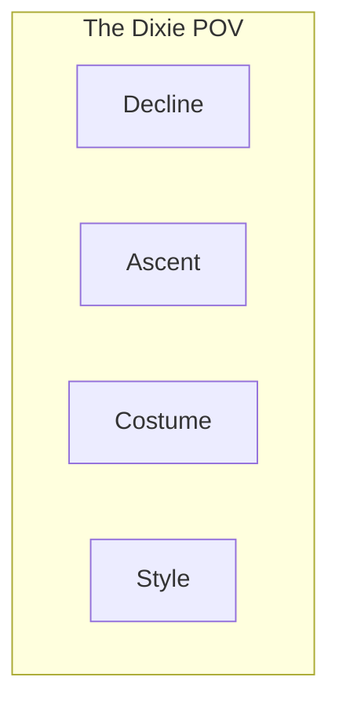
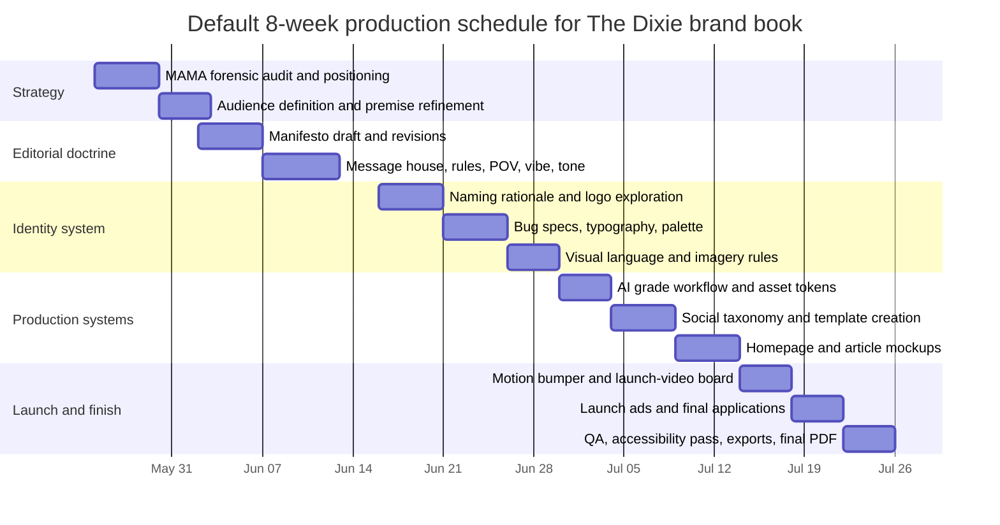

# Reverse-Engineering the MAMA Brand Book for The Dixie

## Executive Summary

The MAMA brand book is not a conventional identity manual. It is a staged persuasion system: first it declares a worldview, then it translates that worldview into messaging, then it turns messaging into behavioral rules, then into taste calibration, then into voice, then into visual mechanics, and only at the end into real-world applications. Across its 49 wide landscape pages, it behaves more like an editorial manifesto fused with a production operating system than like a corporate standards PDF. The table of contents names eight major sections, and the book moves through them in a rigid order: manifesto, messaging house, rules, POV, vibe, tone of voice, brand identity, and social/mockup applications. fileciteturn0file0

What makes the book effective is not its vulgarity or shock posture by itself. Its real strength is that it transforms taste into repeatable decisions. MAMA does this with a small number of formal devices: chapter-opening full-bleed images; a single dominant tagline; a boxed messaging house; rule pages written as commandments; a quadrant map for taste and worldview; one governing atmosphere phrase; “we don’t say / we do say” copy training; a compact wordmark and bug system with spacing and size rules; a finite palette with named colors and usage constraints; yes/no image selection criteria; and finally a limited set of digital applications that prove the system can survive contact with the real world. fileciteturn0file0

The lesson for **The Dixie** is therefore structural, not tonal. You should copy MAMA’s *sequencing logic* and *operational discipline*, while discarding the slur-driven nihilism, grievance posture, and self-narrowing offensiveness that would be strategically bad for a Southern-optimist title whose premise is **“The South Is Back.”** In practice, that means building **The Dixie** as a worldview-first, future-facing regional magazine: warm rather than gummy, stylish rather than precious, reported rather than boosterish, and ascendant rather than aggrieved. The closest translation is: keep MAMA’s bones, keep its page rhythm, keep its insistence on rules and repeatability, but swap transgression-for-transgression’s-sake for a doctrine of **confidence, movement, and modern Southern taste**. fileciteturn0file0

A second lesson is technical. MAMA often behaves like a web-native design system hiding inside an attitude deck. Its typography is divided into clear roles; its color decisions are finite; its mark system has explicit clear-space and minimum-size logic; its social formats are intentionally limited; and its image pipeline is detailed enough to function as a handoff to another designer or editor. That is exactly what makes a brand book useful in production. For The Dixie, those production rules should be tightened further with accessible contrast standards, role-based type hierarchy, reusable design tokens, scannable web layouts, and current platform image constraints for feed, carousel, and story assets. WCAG 2.2 recommends at least 4.5:1 contrast for standard-size text, 3:1 for large text, and 3:1 for non-text graphics that are required to understand content; Material recommends explicit type roles, spacing systems, and design tokens instead of hardcoded values; and Meta’s current Instagram developer documentation specifies feed-image aspect ratios from 4:5 to 1.91:1, story assets at a minimum of 720×1280 with recommended 9:16 or 9:18 ratios, and carousel behavior that crops subsequent images based on the first image, defaulting to 1:1. citeturn3view6turn3view7turn1search0turn4search1turn4search2turn2search0turn2search1turn2search4

The result should be a brand book for The Dixie that feels like this: **regional but not provincial, polished but not genteel, modern but not rootless, confident but not cruel**. If MAMA’s thesis is “getting away with it,” The Dixie’s thesis should be closer to **“the South in ascent”**: a magazine for readers who want to see the region as a generator of design, land stewardship, capital, industry, style, music, food, and ambition, not as a museum piece or a perpetual culture-war hostage. That is the correct forensic translation of the MAMA template into a new Southern title. fileciteturn0file0

## Architecture and Narrative Progression

MAMA’s architecture is unusually clear. It front-loads ideology and only later supplies design assets. That choice matters. The document is telling the reader that a brand is not “logo first”; it is **worldview first, then controlled expression**. The sequence below is the core template worth stealing for The Dixie. fileciteturn0file0

| MAMA stage | Pages | What is on the page | Why it is here | What The Dixie should copy |
|---|---:|---|---|---|
| Cover | 1 | Full-bleed image with centered bug | Seduction before explanation | Start with a thesis image, not a cover letter |
| Tagline | 2 | One dominant phrase on solid red | Compress the brand into a portable line | Use one thesis line, not a paragraph |
| Table of contents | 3 | Eight short section labels | Gives a mental map and teaches voice fast | Use short, branded section names |
| Manifesto | 4–8 | Chapter opener plus worldview argument | Establish enemy, audience, and need | Begin with diagnosis, not mission-speak |
| Messaging house | 9–10 | Chapter opener plus boxed framework | Turn manifesto into repeatable messaging | Translate ideology into copy architecture |
| Rules | 11–12 | Chapter opener plus eight commandments | Define conduct, boundaries, and taboos | Make rules testable and editorial |
| POV | 13–14 | Chapter opener plus quadrant map | Calibrate taste and worldview | Build a reusable editorial compass |
| Vibe | 15–17 | Chapter opener, slogan image, explanatory page | Convert mood into an operating doctrine | Give atmosphere a name and a definition |
| Tone of voice | 18–22 | Chapter opener plus four principle pages | Train writers through contrastive examples | Use do/don’t copy, not vague adjectives |
| Brand identity | 23–39 | Name, logo, bug, type, palette, visual language, imagery, AI process | Encode the look after the worldview is fixed | Put visual system after editorial doctrine |
| Socials and mockups | 40–48 | Avatars, header, video, Instagram, homepage, article, ads | Prove the brand survives real formats | End with applications and proof |
| Closing lockup | 49 | Logo plus tagline on pearl field | Seal memory and thesis | End where you began, but more resolved |

fileciteturn0file0

The document’s narrative progression can be reduced to a simple chain:


The important design theory here is that each section answers a different strategic question. The manifesto answers **why this brand exists**. The messaging house answers **what it repeatedly says**. The rules answer **how it behaves**. The POV map answers **where taste decisions sit**. The vibe answers **what atmosphere everything should emit**. Tone of voice answers **how language sounds in use**. Identity answers **what the brand looks like**. Mockups answer **whether the system is believable in reality**. fileciteturn0file0

That progression also aligns with broader usability logic. Tables of contents help people quickly form a mental model of long content and jump to sections of interest, while scannable formatting improves the usability of long-form information environments. MAMA’s TOC and its alternation of giant headings, short paragraphs, and visual “breather” pages are not just aesthetic choices; they are navigational choices. fileciteturn0file0 citeturn3view8turn0search22turn3view9

The contact sheet below makes that architecture visible at a glance: seduction, compression, contents, worldview, operations, and doctrine.


Those page images also reveal another pattern worth copying: MAMA alternates **full-bleed section openers** with **pearl-ground text pages**. That rhythm prevents fatigue. The image pages set mood and pace; the pearl pages do the conceptual work. For The Dixie, that same alternation should remain, because it is one of the ways the book feels less like a spreadsheet of standards and more like a magazine already alive on the page. fileciteturn0file0

## Forensic Section Analysis

### Foundational rhetoric

#### Cover

**What it does.** MAMA’s cover is a full-bleed, high-saturation aerial image with the red MAMA plaque placed dead-center over the scene. There is no explanatory copy. The cover works as a mood-setter and a confidence signal: the brand assumes it can arrest attention with image plus mark alone. That is a magazine move, not a corporate move. fileciteturn0file0

**How it is built.** The image is not generic lifestyle photography. It is reality viewed in a slightly uncanny way: high angle, aggressive grading, broad color fields, strong negative space around the plaque. The bug is not integrated softly into the image; it interrupts the image, like a pasted stamp. That friction is the point. fileciteturn0file0

**What branding theory it implies.** The cover says: “taste precedes explanation.” A strong brand often needs to be *felt* before it is parsed. In MAMA, that feeling is contemporary weirdness plus hard-edged editorial authority. The cover is therefore a pre-rational argument. fileciteturn0file0

**How to copy it for The Dixie.** Use a full-bleed image that feels specifically Southern *and* contemporary: a container port at dawn, an elevated view of a longleaf burn, a horse trailer at a design fair, a field meeting with a startup founder and a ranch hand, a Gulf shrimp dock shot like fashion editorial. Place a plaque or bug over the image as an interruption, not a watermark. Do not use scenic postcard imagery or sepia warmth. The cover must announce **modern Southern confidence**, not “regional charm.”

**Mistakes to avoid.** Do not put the wordmark directly onto a busy image without a block. Do not use a generic “beautiful South” landscape. Do not add multiple headlines. Do not let the image drift nostalgic; that kills the whole premise.

#### Tagline

**What it does.** Page 2 takes the brand down to one sentence: “Getting Away With It,” set very large on a solid red field with a tiny MAMA bug above it. This is the document’s true thesis page. Every later section is an elaboration of that phrase. fileciteturn0file0

**How it is built.** The page is almost empty. The composition relies on one huge, condensed typographic statement and the force of scale. This is important: a thesis page should feel singular, not informational. The typography implies certainty because there is nothing to argue with around it. fileciteturn0file0

**What branding theory it implies.** Every effective brand book benefits from a compressed statement that can be memorized, repeated, and judged against. MAMA is not saying “our mission is to…”; it is saying “this is the emotional contract.” That is why the page works. fileciteturn0file0

**How to copy it for The Dixie.** Use **THE SOUTH IS BACK** as the thesis page. Set it huge, centered, and alone on a flat field. If you want a backup line, keep it equally compressed: **UP AGAIN**, **WARM RISE**, or **A REGION IN ASCENT**. But do not give this page a paragraph. The paragraph belongs to the manifesto pages, not here.

**Mistakes to avoid.** Do not let the thesis line carry two ideas. Do not use a pun. Do not hedge the claim. A thesis page is not where you explain “what you mean by South” or “who the audience is.” That comes later.

#### Table of contents

**What it does.** The TOC on page 3 is spare and fast. It lists eight sections in short red labels against a pearl field. It is both navigational and tonal: the TOC itself already sounds like the brand. fileciteturn0file0

**How it is built.** The hierarchy is simple: black heading, black numerals, red section names, lots of open space. There is no clutter and no descriptive subtitle under each heading. The section labels are short enough to scan in one glance. That is consistent with TOC best practice: readers use TOCs to understand a document’s structure quickly and to jump to specific sections; shorter, more scannable headings improve that function. fileciteturn0file0 citeturn3view8

**What branding theory it implies.** A contents page is not dead matter. It is a framing device. In MAMA, the TOC teaches the reader what kinds of things count as brand primitives: manifesto, rules, POV, vibe. That is already different from a corporate manual that would likely say “mission, vision, values, logo usage, colors.” fileciteturn0file0

**How to copy it for The Dixie.** Keep the eight-part sequence. Suggested TOC labels: **Manifesto, Message House, Dixie Rules, Dixie POV, Dixie Weather, Tone of Voice, Brand Identity, Socials & Mockups.** If “Weather” feels too cute, use **Vibe** or **Atmosphere**. The labels should be short enough that a person can understand the structure in five seconds.

**Mistakes to avoid.** Do not use long sentence headings. Do not use generic corporate nomenclature. Do not push the TOC into a secondary position; it should come immediately after the thesis.

#### Manifesto

**What it does.** The manifesto runs from pages 4–8 and is the most rhetorically important section in the book. MAMA uses it to diagnose the culture, identify the failure of existing media, define its audience, state its function, and compress the claim back into the tagline. Pages 5–8 move in exactly that order. fileciteturn0file0

**How it is built.** The sequence is disciplined. Page 5 opens with a cultural diagnosis. Page 6 intensifies by claiming that reality is not being described. Page 7 names the intended reader. Page 8 expands scope and then lands the slogan again. Each page uses one oversize headline plus a relatively short paragraph. This prevents manifesto pages from turning into an essay. fileciteturn0file0

**What branding theory it implies.** The manifesto is doing the work of enemy-definition and audience-recognition. Strong brands sharpen identity by defining what is missing, what is fake, and who has been unserved. Even when a brand is not adversarial in tone, the manifesto still has to create contrast. Otherwise the later design system floats free of any reason to exist. fileciteturn0file0

**How to copy it for The Dixie.** Use the same five-beat structure but change the emotional vector from provocation to resurgence.

A workable manifesto skeleton for **The Dixie**:

| Page | Beat | Sample The Dixie copy |
|---|---|---|
| 4 | Section opener | Full-bleed image plus **MANIFESTO** |
| 5 | Cultural diagnosis | **WE LIVE IN A SOUTH PEOPLE KEEP MISDESCRIBING.** The old script says the region is either a joke, a wound, or a costume. Meanwhile the factories are louder, the food is sharper, the campuses are bolder, the style is better, and the ambition is unmistakable. |
| 6 | Failure of existing coverage | **THIS IS A COMEBACK / AND MOST MEDIA ARE STILL WRITING OBITUARIES.** National outlets visit for scandal, weather, or campaign season; heritage outlets keep polishing silver. Neither is very good at describing what is being built right now. |
| 7 | Reader definition | **THE DIXIE IS A MAGAZINE / FOR THE SOUTH IN ASCENT.** For readers who like field sports and architecture, family land and venture rounds, SEC Saturdays and serious books, oyster bars and machine shops. |
| 8 | Compression | The Dixie covers what the comeback looks like: style, work, land, money, appetite, weather, cities, roads, music, and social rise. **THE SOUTH IS BACK.** |

The structure is the thing to copy. The rhetoric should be firm, but it does not need MAMA’s cruelty or slur-based aggression to create edge.

**Mistakes to avoid.** Do not make the manifesto historical and backward-looking. Do not flatten “the South” into one accent or class. Do not write in tourism language. Do not make this the page where you litigate politics line by line. The point is to state a thesis, not to exhaust it.

#### Messaging house

**What it does.** On page 10, MAMA translates the manifesto into a boxed messaging architecture: value proposition, single-minded message, reasons to believe, experience, product, and community. This is where the emotional world becomes operational copy. fileciteturn0file0

**How it is built.** The layout uses a shallow top tier for the two most compressed statements, and a deeper bottom tier for supporting proof and audience logic. The linework is thin, the labels are in red spaced caps, and the copy itself is utilitarian. The page is not trying to be lyrical. That is why it works. fileciteturn0file0

**What branding theory it implies.** A manifesto by itself is inspiring but unstable. A messaging house stabilizes it by answering repeatable questions: What do we promise? What one sentence do we repeat? Why should anyone believe us? What is the user experience? What are we actually making? What kind of public gathers around it? fileciteturn0file0

**How to copy it for The Dixie.** Keep the exact six-field structure. Fill it with sentences that sales, editorial, social, partnerships, and design can all reuse. A filled example appears later in this report.

**Mistakes to avoid.** Do not write slogans in every box. Do not turn “reasons to believe” into adjectives. Do not confuse “experience” with “product.” The point is operational clarity.

#### Rules

**What it does.** MAMA’s rules page is a page of commandments. The rules are sharp, often deliberately offensive, and heavily negative. They define the brand by what it refuses, forbids, or mocks. Some rules concern status and attitude; others ban entire forms and behaviors, like “think pieces” and certain article categories. fileciteturn0file0

**How it is built.** The form is austere: numerals, one-line imperatives, giant condensed type, almost no explanation. MAMA understands that rules feel strongest when they are brief enough to memorize and severe enough to test. fileciteturn0file0

**What branding theory it implies.** Values are soft; rules are behavioral. A rule can guide an editor in a real decision. MAMA’s page is doing tribal work by telling insiders what is permitted, what is taboo, and what counts as weak behavior. That is particularly important for an editorial brand. fileciteturn0file0

**How to copy it for The Dixie.** Use 6–10 rules, each short enough to fit on one line, each specific enough to govern actual editorial choices. The Dixie’s rules should ban nostalgia-for-its-own-sake, regional condescension, and empty grievance; later in this report I provide a fully filled set.

**Mistakes to avoid.** Do not call them “brand values.” Do not write abstract virtues like integrity or authenticity. Do not create rules that cannot be enforced in real story meetings.

#### POV matrix

**What it does.** On pages 13–14, MAMA uses a four-quadrant worldview map with deliberately inflammatory axis labels and a few cultural examples positioned inside the field. The exact labels matter less than the mechanism: the map turns vague taste into spatial logic. fileciteturn0file0

**How it is built.** The page is clean and diagrammatic: dotted axes, arrows, four pole labels, example objects or figures, and lots of blank space. The blank space is part of the logic. It lets the quadrants read as territory. fileciteturn0file0

**What branding theory it implies.** A quadrant is useful when a brand wants its subjectivity to become repeatable. Editors can ask: where does this story, image, or phrase land on our map? That is far more practical than saying “make it feel right.” fileciteturn0file0

**How to copy it for The Dixie.** Use two tensions that matter to your positioning. My recommended option is **Costume ↔ Style** on the horizontal axis and **Decline ↔ Ascent** on the vertical axis. The target quadrant is **Style + Ascent**. That puts The Dixie against both heritage cosplay and doom-media grievance.

**Mistakes to avoid.** Do not use weak axis labels like “traditional / modern” or “serious / playful.” Quadrant poles need bite. They should make decisions easier, not flatter the team.

#### Vibe

**What it does.** Pages 15–17 create what may be the most reusable section in the book: MAMA gives its emotional atmosphere a short name, “High Present,” then unpacks each word on page 17. This is distinct from tone of voice. It governs the whole feeling system. fileciteturn0file0

**How it is built.** First comes a mood image opener, then a giant slogan page, then an exegesis page. Page 17 defines “high” in multiple senses and “present” as temporal attention. It then converts that phrase into testable writing guidance: if a piece does not read as sharp, alert, amused, and more alive than the reader, rewrite it. fileciteturn0file0

**What branding theory it implies.** A vibe phrase is portable doctrine. It can guide writing, art direction, event styling, and social capture without requiring a manifesto every time. This is extremely useful for multi-person teams. fileciteturn0file0

**How to copy it for The Dixie.** Give the magazine its own two-word doctrine. I recommend **Warm Rise** and unpack it later in this report. Other viable options are **Porchlight Future**, **Sunbelt Ascendant**, **Blue-Hour Build**, and **Gulf Modern**.

**Mistakes to avoid.** Do not pick a phrase that sounds cool but explains nothing. If the phrase cannot be broken into operational meanings, it is decorative, not doctrinal.

#### Tone of voice

**What it does.** Pages 18–22 are a writer-training system. MAMA names four voice principles—Gonzo, Transgressive, Hyper-real, and Irreverent—then gives each one a short essay, a “we don’t say / we do say” contrast, and a rationale block. That is unusually good copy instruction. fileciteturn0file0

**How it is built.** Every tone page follows the same form: principle name, definition, bad example, better example, justification. The repeated form matters because it standardizes learning. This is what makes the section usable rather than inspirational. fileciteturn0file0

**What branding theory it implies.** Contrastive training is more practical than adjective piles. Writers learn a brand voice faster when they see what is out-of-bounds and what a stronger sentence looks like instead. It is the same logic that makes good style guides useful. fileciteturn0file0

**How to copy it for The Dixie.** Keep the page formula exactly. Replace the four MAMA principles with four Dixie principles that match the positioning: **Reported, Ascendant, Stylish, Wry.** Filled examples appear later in this report.

**Mistakes to avoid.** Do not say the brand is “smart, bold, authentic, and premium.” That is meaningless instruction. Tone needs friction and example sentences.

### Identity mechanics

The contact sheet below shows the core identity-and-system section: bug, usage rules, typography, palette, imagery criteria, and the image-treatment workflow. This is the part of the book that turns attitude into reproducible assets. fileciteturn0file0


#### Name

**What it does.** On page 24, MAMA rationalizes the name with three moves: primal origin, anti-performance softness, and built-in joke. The page argues that the name is instinctive, honest, and already subversive before a reader has read a paragraph. fileciteturn0file0

**How it is built.** The page uses a softer-seeming title-case “Mama” in red, then follows with prose. That is notable because page 25 shifts into the all-caps hard-edged logo. The separation between *name meaning* and *visual mark* is deliberate. One page humanizes; the next page industrializes. fileciteturn0file0

**What branding theory it implies.** Names with potential contradiction become stronger when the contradiction is explained rather than buried. MAMA’s contradiction is softness inside a men’s magazine. The page does not soften that contradiction; it weaponizes it. fileciteturn0file0

**How to copy it for The Dixie.** This is one of the most important places to be more careful than MAMA. Because **“Dixie”** can trigger Confederate, retrograde, or nostalgia-coded readings, The Dixie’s name page must explicitly redefine the term. It should say, in effect: *This is not memorial South. This is current South. “Dixie” here names tempo, weather, appetite, and confidence—not reenactment.* If you do not do that work on the page, the rest of the book will spend energy fighting a misreading you could have preempted.

**Mistakes to avoid.** Do not pretend the name is neutral. Do not leave the word historically unframed. Do not make the rationale purely etymological. The point is to tell the reader what the name licenses.

#### Logo

**What it does.** The logo page on page 25 is almost silent: one very large red plaque with white wordmark. No paragraph. That silence is strategic. MAMA is treating the logo less as an argument than as a fact. fileciteturn0file0

**How it is built.** The mark is blunt, rectangular, and highly legible. It behaves like a stamp or masthead, not a calligraphic signature. That makes it robust on photographs, mockups, social tiles, and web headers. fileciteturn0file0

**What branding theory it implies.** If a brand’s imagery is complex and volatile, the mark benefits from being simple and fixed. MAMA’s logo functions as a stable interruptor against visual chaos. fileciteturn0file0

**How to copy it for The Dixie.** Use a wordmark that is either a masthead or a plaque, not a decorative emblem. The South Is Back is a large claim; the mark should sound like a title you can put on a website, cover, jacket, cap, or bumper sticker. I recommend a primary **THE DIXIE** masthead and a shorter **DIXIE** plaque as the bug.

**Mistakes to avoid.** Do not over-illustrate the logo with antlers, crests, cotton bolls, script flourishes, or faux-historic seals. If the logo already looks nostalgic, no amount of manifesto copy will save the positioning.

#### Bug system

**What it does.** Pages 26–27 distinguish between the main logo page and the “bug,” which is the recurring small stamp used across contexts. Page 26 gives the bug specification; page 27 gives environmental rules, clear space, minimum size, and do/don’t examples. The bug is the book’s true repetition device. fileciteturn0file0

**How it is built.** The bug has a locked wordmark, a default color, alternate jewel-tone variants, fixed wordmark color, clear-space logic, and minimum sizes. Page 27 explicitly forbids several common misuses: no floating directly on photographs, no similar-saturation reds near the ruby version, no tints, no gradients, no shadows, no skew, and no rotation. It also requires a solid plaque and gives a minimum width of 32 px on screen and 0.5 inches in print. fileciteturn0file0

**What branding theory it implies.** A bug is not just a small logo. It is a frequency engine. When it is small, consistent, and placed correctly, it accumulates recognition through recurrence. That is why the usage rules are more important than the graphic itself. Formal brand systems often define clear space and minimum size for exactly this reason. fileciteturn0file0 citeturn1search2turn5search1turn5search8

**How to copy it for The Dixie.** Build three levels: **primary masthead**, **DIXIE plaque bug**, and **DX micro icon**. Use the plaque on editorial images and social posts; use the micro icon for favicon and avatar contexts. Give the plaque a default color and a small set of approved alternates. Set clear space as a function of bug height, not arbitrary pixels.

**Mistakes to avoid.** Do not let the bug float bare over photography. Do not create ten variants. Do not let the bug become an effect layer. Do not keep the same minimum size as MAMA if your mark is longer; longer marks need larger minimums.

#### Typography

**What it does.** Page 28 makes typography radically simple. MAMA uses one display face—Heading Now 56 Bold at negative character spacing—and one text face—Arial Narrow with positive spacing. That is the whole system. fileciteturn0file0

**How it is built.** The display choice is condensed, vertical, and aggressive. The text choice is narrow, plain, and functional. The two together create an editorial voice: headlines shout, body copy gets out of the way. Nothing about the type system is precious. fileciteturn0file0

**What branding theory it implies.** Restriction creates identity. A small type system is easier to enforce and easier for readers to memorize. Material likewise emphasizes explicit type roles rather than arbitrary stylistic proliferation, organizing text styles into named purposes such as display, headline, title, label, and body. fileciteturn0file0 citeturn1search0

**How to copy it for The Dixie.** Keep two families, not six. For example:  
- **Display:** a condensed editorial sans or slab for mastheads, chapter titles, social headlines, and callouts.  
- **Text:** a screen-friendly editorial serif for body, decks, and pull quotes.  

If you want a practical open-license direction, use a *Druk-like* condensed sans substitute for display and **Spectral** or **Source Serif 4** for text. Make the hierarchy role-based, not ornamental.

**Mistakes to avoid.** Do not use one font for everything. Do not use a decorative Southern script. Do not let the display face feel vintage unless the entire brand wants to skew archival, which The Dixie should not.

#### Palette

**What it does.** Page 30 formalizes the palette as nine stones: seven chromatic jewel tones plus two structural neutrals, Onyx and Pearl. It also locks the brand red to **Mama Ruby #FF0031**, forbids pure black and pure white in favor of the neutrals, and limits layouts to 2–3 jewels at a time. fileciteturn0file0

**How it is built.** The page names each swatch, gives Pantone and hex references, and explains usage. The seven chromatics are Ruby, Emerald, Sapphire, Topaz, Amethyst, Citrine, and Coral. Onyx is **#1A1A1A** and Pearl is **#F4EFE6**. Citrine is reserved for graphic punctuation. This is not just a palette page; it is a usage-rule page. fileciteturn0file0

**What branding theory it implies.** Loud brands often fail when they confuse “many colors” with “anything goes.” MAMA avoids that by constraining combinations. Carbon and WCAG make the complementary point from the usability side: color systems need both harmony and legibility, and text or required graphics must maintain adequate contrast. fileciteturn0file0 citeturn1search5turn3view6turn3view7

**How to copy it for The Dixie.** Build a **Southern chroma system** rather than a “heritage” palette. Use named swatches tied to region and material life. Lock one anchor color. Use two neutrals instead of pure black and white. Restrict each layout to 2–3 chromatics maximum.

**Mistakes to avoid.** Do not throw the whole palette onto a page. Do not make navy, cream, and hunter green your only colors if that pushes the magazine into established lifestyle-magazine cliché. Do not ignore contrast when you move from the book to the web.

#### Visual language

**What it does.** Pages 31–34 establish MAMA’s visual language with three binary distinctions: **Uncanny not Surreal**, **Narrative not Abstract**, and **Contemporary not Nostalgic**. That is one of the best parts of the book, because it uses negative definition to stop aesthetic drift. fileciteturn0file0

**How it is built.** Each page shows a left-side approved image and a right-side rejected image, with a short verbal rule above. By pairing image and counter-image, the book makes taste legible very fast. fileciteturn0file0

**What branding theory it implies.** “Not this” is often more useful than “be creative.” Negative visual rules keep teams from free-associating into drift. They also compress abstract taste into decisions a freelancer can follow. fileciteturn0file0

**How to copy it for The Dixie.** Give The Dixie its own three binaries. I recommend:  
- **Current not Heritage-Cosplay**  
- **Lived not Staged**  
- **Kinetic not Pastoral**  

That preserves the MAMA method while translating the emotional aim.

**Mistakes to avoid.** Do not use broad adjectives like “sophisticated” or “premium.” Always pair approved and rejected image worlds.

#### Imagery guidelines

**What it does.** Page 35 condenses image selection into a yes/no checklist and then adds a second block of practical art-direction notes. Approved imagery should be narrative, uncanny, and contemporary; rejected imagery is abstract, surreal, or nostalgic. Practical notes specify single focal subjects or dynamic narrative settings, matte jewel-tone skews, frontal or bird’s-eye POV, and small detail tweaks to produce oddity without fantasy. fileciteturn0file0

**How it is built.** The page is short, list-driven, and operational. It is not trying to “inspire” the designer. It is trying to stop the wrong file from getting selected. That is why it belongs in a production-ready book. fileciteturn0file0

**What branding theory it implies.** Good imagery guidelines convert taste into checklists. MAMA’s page says, in effect: the brand is not random weirdness; it is *reality plus calibration*. That distinction matters. fileciteturn0file0

**How to copy it for The Dixie.** Your imagery rules should control subject matter, temporal signal, point of view, and degree of stylization. For The Dixie, images should be contemporary, regionally specific, materially rich, and alive with movement or implication. The art direction brief later in this report translates that into a copy-ready checklist.

**Mistakes to avoid.** Do not allow empty scenic beauty. Do not allow stock-photo smiles. Do not allow sepia, film-burn nostalgia, rusted-truck fetish, or plantation-signifier shorthand.

#### Image-treatment and AI pipeline

**What it does.** Pages 36–39 supply a detailed “AI prompt (WIP)” and a three-stage “MAMA filter pass process.” The instructions specify editorial color grade, jewel-tone pushes, tonal shaping, texture, camera-profile feel, saturation, brightness, editorial wash, final feel, and hard constraints like “do not crop,” “do not add elements,” and “do not over-stylize.” These pages are effectively a color-postproduction SOP. fileciteturn0file0

**How it is built.** The writing is procedural. It calls out Kodachrome 64 tendencies, Portra/Kodachrome density, emerald and sapphire pushes, elimination of teal, raised black point, subtle S-curve contrast, halftone texture, 35mm grain, and a final objective: glossy editorial magazine, still photograph, not illustration. This is production language, not brand poetry. fileciteturn0file0

**What branding theory it implies.** The book does not trust “taste” alone. It specifies a pipeline so the look can be reproduced by multiple people. That is one of the clearest signs that MAMA understands branding as a production machine, not just an aesthetic attitude. Material’s guidance on design tokens points in the same systems direction: reusable style values prevent drift and remove dependence on hand-tuned one-offs. fileciteturn0file0 citeturn4search2

**How to copy it for The Dixie.** Absolutely steal this section. The Dixie should have its own copy-ready image-grade template for covers, features, social, and homepage hero imagery. The key is to specify *surface treatment*, not to hallucinate new subjects. Keep the “do not crop / do not add elements / do not drift into illustration” discipline.

**Mistakes to avoid.** Do not let AI prompt pages become a fantasy prompt. The best production prompts are conservative about composition and aggressive only about grade, texture, and atmosphere.

### Applications and production

The final section of MAMA is where the document proves it is not just a concept deck. It shows profile images, headers, motion ideas, feed types, homepage, article page, and ads. That matters because a brand is only credible when it survives actual formats. fileciteturn0file0


#### PFPs and header

**What it does.** Page 41 shows both round and square profile images, plus a header crop. This acknowledges platform reality: different services clip and frame identity assets differently. fileciteturn0file0

**How it is built.** The profile images use the same plaque over image strategy, proving that the bug can survive tiny contexts. The header crop uses a strong, close image with dominant color and enough quiet area for possible platform overlays. fileciteturn0file0

**What branding theory it implies.** If the brand cannot survive in avatar scale, it does not have a true bug system. MAMA treats the avatar as a first-order brand surface, not an afterthought. fileciteturn0file0

**How to copy it for The Dixie.** Export both round-safe and square-safe avatars. Use the **DX** micro icon for the smallest contexts and the **DIXIE plaque** for larger ones. Create one 3:1 header master and crop derivatives.

**Mistakes to avoid.** Do not rely on the full primary wordmark in the tiniest avatar size. Do not use a photographic avatar without the bug.

#### Video bumpers

**What it does.** Page 42 introduces a concept for video bumpers: a wolf-whistle with the logo appearing or transforming from illustration. Even though the page shows only a simple mockup and a link reference, the important thing is that motion identity exists in the system. fileciteturn0file0

**How it is built.** The page separates concept from mockup. That is smart. Motion systems often need to be described in prose before they are finished in animation. fileciteturn0file0

**What branding theory it implies.** A media brand should consider sonic and motion signatures part of identity, not bolt-ons. Motion is where a magazine becomes a media company. fileciteturn0file0

**How to copy it for The Dixie.** Create a short bumper built from one recognizably Southern but contemporary audio cue: a train horn, screen-door snap, cicada burst, crowd swell, or steel-string harmonic. Pair it with a clean plaque reveal, not a gimmicky particle effect.

**Mistakes to avoid.** Do not make the animation busier than the editorial. Do not let the bug distort or become a novelty object.

#### Launch video

**What it does.** Page 43 describes a launch-video concept that dramatizes the brand naming idea through history and pivots toward the branded present. This is the manifesto in motion. fileciteturn0file0

**How it is built.** The page again separates concept from mockup. The mockup suggests cinematic, highly graded editorial imagery. The core point is narrative: the launch film tells the brand origin and then reveals the brand’s actual tone. fileciteturn0file0

**What branding theory it implies.** Launch videos should not just montage aesthetics; they should stage the thesis. They are especially useful when the brand needs to redraw a category or a loaded name. fileciteturn0file0

**How to copy it for The Dixie.** Make a 45–60 second launch film that begins with tired images or scripts about the South, then cuts forward into the present: fabrication floors, rodeo lights, hotel bars, labs, football tunnels, marsh roads, print shops, listening rooms, and people in motion. End with the thesis line: **THE SOUTH IS BACK.**

**Mistakes to avoid.** Do not make the film purely scenic. Do not let it become a tourism reel. The turn has to be from stereotype to current force.

#### Instagram post types

**What it does.** Pages 44–45 are one of the most useful production sections in the whole book. MAMA explicitly limits its Instagram to a small set of recurring post types: title over image, pull quote, logo plus image, and weekly templated posts. fileciteturn0file0

**How it is built.** The concept page lists the four types. The following page shows examples of each. This makes the system legible at once. The brand is trying to create recognizability through repetition, not through infinite experimentation. fileciteturn0file0

**What branding theory it implies.** A limited social taxonomy produces a coherent feed faster than an endlessly reinvented one. Platform constraints reinforce that logic. Meta’s current documentation supports feed-image aspect ratios from 4:5 to 1.91:1, recommends 9:16 or 9:18 stories at a minimum of 720×1280, and notes that carousel images are cropped based on the first image, defaulting to square unless otherwise controlled. That means a repeatable templating system is not merely aesthetic; it is operationally sane. fileciteturn0file0 citeturn2search0turn2search1turn2search4

**How to copy it for The Dixie.** Use four post types only:  
- **Headline over image**  
- **Dispatch quote card**  
- **Plaque over image**  
- **Weekly series card**  

The exact specifications for The Dixie versions appear later in this report.

**Mistakes to avoid.** Do not create twelve social systems. Do not let every post invent a new type scale or color structure. Variety should come from coverage, not from design reinvention.

#### Homepage

**What it does.** Page 46 defines the homepage concept as a header image with a swipe-able stack of select articles beneath, and shows desktop mockups that mix hero imagery, stacked articles, and bold graphic bars. fileciteturn0file0

**How it is built.** The mockup uses a huge branded hero, strong article labeling, and condensed display type. It behaves like a magazine front page translated into a web frame. It is also highly scannable: giant headline, visual sectioning, and strong hierarchy. That tracks with web-usability research showing that readers scan rather than read, and that formatting and hierarchy help them locate what they need quickly. fileciteturn0file0 citeturn0search22turn3view9

**What branding theory it implies.** Homepages are not neutral containers. They can embody editorial posture. MAMA’s homepage says the lead story is an event. The rest of the page is a controlled stack beneath the event. fileciteturn0file0

**How to copy it for The Dixie.** Build a homepage around one heroic present-tense story plus a swipeable or stackable set of secondary stories below. Give the page a strong issue line and section cadence. Put the bug or masthead in a place of immediate control, not buried in a nav strip.

**Mistakes to avoid.** Do not create a homepage that looks like a commerce catalog. Do not make all stories visually equal. A brand homepage needs a lead.

#### Article layout

**What it does.** Page 47 states the article concept clearly: a header image with alternating columns, images, pull quotes, and top article links sitting in blank space. The mockup shows a bold headline, a strong deck, metadata, and generous spacing. fileciteturn0file0

**How it is built.** The layout uses blank space as structure, not decoration. Pull quotes and side material create rhythm. The result is editorial and legible at the same time. This is consistent with long-form usability guidance: formatting techniques that break up text improve scannability and help readers traverse content. fileciteturn0file0 citeturn3view9

**What branding theory it implies.** Articles are the true test of whether a magazine brand has depth. Covers and social tiles can fake coherence; article pages cannot. If the article template is weak, the brand will collapse into promo surfaces. fileciteturn0file0

**How to copy it for The Dixie.** Use a strong feature-head module, a clear deck, a generous metadata line, one pull quote every 700–900 words, and white—or rather magnolia—space to keep the article from feeling cramped. Use asymmetry, but controlled asymmetry.

**Mistakes to avoid.** Do not set long features as uninterrupted single-column walls. Do not let side material overwhelm the writing. Do not overdesign the body text.

#### Launch ads

**What it does.** Page 48 defines MAMA’s launch ads as three possible routes: recut launch-video assets, article cards with must-read headlines, and cryptic pull-quote ads. The examples show the willingness to use confrontation and culture-friction as acquisition tactics. fileciteturn0file0

**How it is built.** The ad logic is simple: one phrase or one headline, one strong visual frame, one hard bug, strong contrast. There is no “learn more about our community” softness. fileciteturn0file0

**What branding theory it implies.** Launch creative is not just promotional; it is category-entry behavior. MAMA uses ads to extend the manifesto. That is coherent, even where the copy is strategically extreme. fileciteturn0file0

**How to copy it for The Dixie.** Use a less inflammatory but still declarative form. Good launch ad routes for The Dixie are:  
- “The South Is Back” hero declarations  
- article cards with sharp, surprising headlines  
- short quote cards that imply motion, style, or local authority  
- short video recuts of launch-film imagery  

**Mistakes to avoid.** Do not use generic subscription language. Do not make the ads safe to the point of invisibility. But also do not mistake reputational self-harm for edge.

## Underlying Branding Theory

### Brand as worldview

MAMA begins with diagnosis, not product. That is the essential theoretical move. The document assumes that the brand exists because reality is being misdescribed and a specific reader lacks a fitting publication. Only after that argument is made does the book define product, audience experience, or visual form. This is why the manifesto, message house, and rules come before logo, type, and color. fileciteturn0file0

For The Dixie, the equivalent move is to say: the South is being framed either as caricature, grievance object, or heritage set piece, and The Dixie exists to describe the region as **current force**. If you skip that worldview layer, the later visual system will read decorative rather than necessary.

### Brand as editorial behavior

The rules page, POV matrix, vibe section, and tone pages together form an editorial constitution. They govern what gets commissioned, how headlines are written, what image worlds are acceptable, and which angles count as “on brand.” That is much stronger than merely saying “our tone is witty and premium.” fileciteturn0file0

This is the point The Dixie should embrace hardest. A Southern magazine becomes distinctive not when it says “style, culture, outdoors” on the cover, but when it can explain *which stories it rejects, which style worlds it rejects, which stale regional scripts it rejects, and what kind of sentence it will or will not publish*. That is brand as editorial behavior.

### Brand as repetition system

MAMA’s bug, color system, section-title rhythm, post taxonomy, and application pages produce recognition through recurrence. The same plaque returns again and again. The same red labels return again and again. The same few post types return again and again. Repetition is doing the memory work. fileciteturn0file0

That systems logic is exactly what design-token thinking formalizes in digital products: instead of hardcoded one-off style decisions, you define reusable values for colors, fonts, and measurements so the brand can scale without visual drift. Material explicitly recommends tokens for this reason, and its spacing guidance notes that spacing itself shapes a product’s perceived seriousness and personality. citeturn4search2turn4search1

For The Dixie, the practical lesson is simple: create a handful of repeatable modules and use them relentlessly.

### Brand as controlled transgression

MAMA’s tone pages and launch ads show that the publication sees offense as part of its status performance. But the more interesting point is not the offense itself; it is the **control**. The book governs that transgression with rules, do/don’t examples, image boundaries, and specific platform types. In other words, it tries to make chaos reproducible. fileciteturn0file0

The Dixie should retain the “controlled” half and drop most of the “transgressive” half. Its version of controlled edge should be: surprising angles, class confidence, exact local reporting, material vividness, wry humor, and anti-cliché heat. The lesson is to systematize force, not to imitate insult.

### Brand as anti-corporate corporate system

MAMA rhetorically rejects corporate polish, but structurally it is quite corporate in the best sense: it has message architecture, formal rules, mark specifications, palette governance, and production procedures. That paradox is central to its success. It talks like a renegade while behaving like a disciplined system. fileciteturn0file0

For The Dixie, this is good news. You can sound supple, local, and alive while still running a formal standards deck. In fact, you probably must, because the brand’s promise of regional modernity depends on looking coordinated rather than folksy-chaotic.

### Brand as production machine

The AI prompt pages, social templates, homepage mockup, article mockup, and ad examples all point in the same direction: the brand book is meant to enable content production by more than one person. It is a production machine. fileciteturn0file0

That should be the final test for The Dixie. If the book does not help a new editor, designer, social producer, or freelance photographer make the next thing correctly, it is not finished.

## The Dixie Adaptation and Copy-Ready Templates

The table below translates each MAMA mechanism into a Dixie mechanism. It preserves structure while changing the underlying emotional and cultural logic. fileciteturn0file0

| MAMA mechanism | What it does in MAMA | The Dixie translation |
|---|---|---|
| Manifesto | Cultural diagnosis through confrontation | Regional comeback doctrine |
| Rules | Commandments and taboos | Editorial standards and anti-cliché boundaries |
| POV matrix | Polarized taste map | Style-vs-costume / ascent-vs-decline compass |
| High Present | Governing atmosphere | **Warm Rise** or allied vibe phrase |
| Tone of voice | Voice training by contrast | Reported, ascendant, stylish, wry |
| Name page | Turn contradiction into strength | Reframe “Dixie” as current, not memorial |
| Logo | Plaque as stamp | Masthead plus plaque bug |
| Jeweltones | Saturated editorial palette | Southern chroma system with warm neutrals |
| Imagery rules | Reality made uncanny | Contemporary South made kinetic and exact |
| AI approach | Surface-treatment SOP | Regional editorial grading workflow |
| Socials & mockups | Prove system on platforms | Prove comeback thesis in feed, site, and launch creative |

### The Dixie manifesto sample

Here is a copy-ready manifesto draft that borrows MAMA’s construction but shifts the underlying theory from provocation to optimistic Southern ascent:

| Page | Recommended copy |
|---|---|
| 5 | **WE LIVE IN A SOUTH PEOPLE KEEP MISDESCRIBING.** The old script says the region is either a joke, a wound, or a costume. Meanwhile the money is moving, the factories are humming, the restaurants are better, the style is sharper, and the confidence is real. |
| 6 | **THIS IS A COMEBACK / AND MOST MEDIA ARE STILL WRITING OBITUARIES.** National coverage comes South for weather, scandal, or elections and leaves before the meeting starts. Heritage titles keep polishing silver while the region builds studios, plants, labels, hotels, foundries, and firms. |
| 7 | **THE DIXIE IS A MAGAZINE / FOR THE SOUTH IN ASCENT.** For readers who like field sports and architecture, family land and startup energy, SEC Saturdays and good tailoring, machine shops and listening rooms, city dinners and county roads. |
| 8 | The Dixie covers what the comeback looks like: land, money, appetite, style, labor, weather, design, music, roads, cities, and social rise. **THE SOUTH IS BACK.** |

### The Dixie rules

These rules keep MAMA’s compact, commandment-like structure while changing the brand’s substance.

| Rule | What it governs |
|---|---|
| The present beats the reenactment. | Rejects nostalgia-as-default |
| No grievance posture. | Avoids resentment media |
| No plantation cosplay, no sepia. | Sets a hard visual and cultural boundary |
| Report first; pronounce second. | Protects the magazine from hot takes |
| Style must be lived, not staged. | Filters imagery, fashion, interiors, and profiles |
| Regional is not provincial. | Keeps the brand outward-facing and worldly |
| Every story must contain motion. | Requires evidence of change, rise, movement, or consequence |
| Never talk down to the reader or the region. | Preserves confidence and warmth |

### The Dixie POV matrix

My recommended matrix for The Dixie is:

- **Horizontal:** Costume ↔ Style  
- **Vertical:** Decline ↔ Ascent

The target zone is **Style + Ascent**.



That simple diagram is only a placeholder. In the actual book, use a real quadrant with exemplars. The quadrant logic should read like this:

| Quadrant | Editorial meaning | Use for The Dixie |
|---|---|---|
| Costume + Decline | heritage cosplay, stale grievance, sepia defeatism | Reject |
| Style + Decline | tasteful but pessimistic doom coverage | Use sparingly |
| Costume + Ascent | gaudy boosterism, real-estate brochure energy | Reject |
| Style + Ascent | current, elegant, restless Southern power | Target zone |

### The Dixie vibe

I recommend **Warm Rise** as the governing phrase.

| Word | Meaning | Operational consequence |
|---|---|---|
| Warm | hospitality, appetite, weather, color temperature, human approachability | Writing should feel welcoming but not mushy; imagery should feel sunlit or materially warm, not cold-minimal |
| Rise | social climb, economic motion, regional confidence, vertical energy | Stories should show movement, openings, gains, ambition, buildout, or cultural ascent |

A page-17-style explanation could read:

> **WARM** as in alive, human, appetizing, sun-struck, hospitable without apology.  
> **RISE** as in upward pressure — new money, new buildings, new style, new confidence, new reasons to stay, return, or build.  
> Every piece of Dixie content should feel like it was made from inside that state.

Other viable vibe phrases:
- **Porchlight Future**
- **Sunbelt Ascendant**
- **Blue-Hour Build**
- **Gulf Modern**

### The Dixie tone-of-voice principles

These four principles preserve MAMA’s contrastive teaching method while fitting a Southern-optimist editorial posture.

| Principle | What it means | We don’t say | We do say |
|---|---|---|---|
| Reported | Firsthand, scene-based, specific | “People are flocking South.” | “By lunch in Huntsville the parking lot already held a Rivian, two F-250s, and a contractor’s Tahoe with a venture sticker in the rear glass.” |
| Ascendant | Upward-looking, energetic, current | “The coasts finally respect us.” | “The region quit waiting for permission and started opening firms, restaurants, studios, plants, and schools that look like the future.” |
| Stylish | Tactile, composed, visually literate | “A charming ode to Southern elegance.” | “He wears white denim in February, keeps quail dogs behind the office, and built a hospitality brand out of a feed store.” |
| Wry | Funny without sneering | “Look at these idiots.” | “The gala had seed investors, state senators, a country singer, and one man so overdressed he qualified as infrastructure.” |

### The Dixie messaging house

Below is a fully filled messaging house modeled on MAMA’s page-10 structure. fileciteturn0file0

| Field | Filled example for The Dixie |
|---|---|
| Value proposition | **The Dixie is the magazine that covers the contemporary South as an engine of style, appetite, work, land, and ambition — not as a caricature, a grievance zone, or a museum.** |
| Single-minded message | **The South is back.** |
| Reasons to believe | We report on the ground. We mix culture, design, business, land, infrastructure, sports, and place. We reject both national condescension and regional cosplay. Our taste is contemporary, specific, and lived. |
| Experience | Literate without being academic. Stylish without being precious. Warm without being soft. Regional without being provincial. A good time that still knows what it is saying. |
| Product | Web-first magazine, features, columns, dispatches, newsletters, short video, and a tight social system built for repeatability. |
| Community | Builders, landholders, restaurateurs, athletes, designers, musicians, founders, mayors, hotel people, preservationists, and readers who think regional life can still be glamorous and ambitious. |

### The Dixie logo and bug system

MAMA spends pages 25–27 separating logo from bug and then specifying clear space, minimum size, and forbidden uses. That is exactly the right pattern to reuse. fileciteturn0file0

| Element | Specification for The Dixie | Notes |
|---|---|---|
| Primary masthead | **THE DIXIE** wordmark, horizontal, all caps | Used on covers, title pages, website header, print fronts |
| Editorial bug | **DIXIE** plaque | Shorter and more repeatable than full masthead |
| Micro icon | **DX** monogram | Used for avatar, favicon, watermark-size contexts |
| Default bug color | **Iron Clay** plaque with **Magnolia** type | Anchor color for recurrence |
| Alternate bug colors | Delta Pine, Gulf Current, River Silt, Brass Rail, Satsuma | Keep to 5–6 approved variants |
| Clear space | Minimum **0.5× bug height** on all sides | Increase to 1× in hero placements |
| Minimum digital size | DX icon 20 px; DIXIE bug 40 px; THE DIXIE masthead 96 px | Longer marks need larger thresholds than MAMA’s 32 px bug |
| Minimum print size | DX icon 5 mm; DIXIE bug 12 mm; masthead 32 mm | Adjust by substrate and reproduction method |
| Forbidden uses | No gradients, no shadows, no skew, no outline, no photo-floating without plaque, no low-contrast color pairings | Mirrors MAMA’s hard usage logic |
| Approved placements | Magnolia field, River Silt field, complementary color field, fixed plaque over photography | Never let the mark dissolve into a picture |

Even though WCAG exempts logotypes from minimum contrast requirements as logos, body text, UI labels, and graphics that convey meaning still need contrast discipline. For web and app surfaces, keep standard-size text at 4.5:1 contrast minimum, large text at 3:1, and required non-text graphics at 3:1. citeturn3view6turn3view7

### The Dixie typography hierarchy

Use two families, then assign explicit roles.

| Role | Recommendation | Treatment |
|---|---|---|
| Masthead and chapter title | Condensed editorial sans or slab | All caps, heavy, tight tracking |
| Feature headline | Same display family or a companion high-contrast serif | 5–9 words ideally |
| Deck and pull quote | Editorial serif | Sentence case, comfortable line length |
| Body text | Same serif family | Moderate line height, generous margins |
| Labels and nav | Display family in smaller weight | Uppercase or small caps, wide tracking |

A copy-ready pairing:

| Family | Suggested use | Practical direction |
|---|---|---|
| Display | Masthead, section titles, social headlines | Druk/Tungsten-like condensed display; open substitute: Oswald or League Gothic |
| Text | Body, deck, pull quote | Spectral or Source Serif 4 |

This echoes MAMA’s two-role simplicity while producing a more cultured and less abrasive reading experience. Material’s emphasis on role-based type scale is the right underlying logic here. fileciteturn0file0 citeturn1search0

### The Dixie palette

MAMA’s key insight is not “use bright colors”; it is “name them, limit them, and police them.” The Dixie should do the same. fileciteturn0file0

| Swatch | Hex | Use ratio | Role |
|---|---:|---:|---|
| Magnolia | `#F3E9DC` | 45% | Primary background neutral |
| River Silt | `#1D1B19` | 20% | Primary text / dark field |
| Iron Clay | `#B64933` | 12% | Brand anchor / bug default |
| Delta Pine | `#2F5A49` | 8% | Secondary field / depth |
| Gulf Current | `#1E5A86` | 7% | Contrast field / digital cool |
| Satsuma | `#E57A2E` | 4% | Small accent / vivid warmth |
| Brass Rail | `#C6A23A` | 2% | Punctuation / lines / trim |
| Muscadine | `#6B5C8F` | 1.5% | Rare accent / evening mood |
| Azalea | `#D98AA1` | 0.5% | Rare seasonal accent |

Usage rules:

| Rule | Guidance |
|---|---|
| Chromatics per layout | Use 2–3 maximum |
| Default text pair | River Silt on Magnolia |
| Reverse text pair | Magnolia on River Silt, Delta Pine, Gulf Current, Iron Clay |
| Accent policy | Brass Rail and Satsuma for punctuation, not body-copy fields |
| Forbidden move | No full-spectrum layouts, no pure black, no pure white |

Carbon and WCAG both support this discipline: palettes should work harmoniously within a page and maintain readable contrast when applied to text and required graphics. citeturn1search1turn1search5turn3view6turn3view7

### The Dixie imagery brief

Here is the direct translation of MAMA’s page-35 method into a Dixie art-direction checklist. fileciteturn0file0

| Use | Avoid |
|---|---|
| Contemporary Southern settings | Nostalgic, sepia, faux-vintage Americana |
| Real people in real work or social situations | Stock smiling lifestyle scenes |
| Narrative frames with implied action | Scenic emptiness with no subject |
| Frontal or elevated POV | fuzzy faux-documentary ambiguity |
| Material specificity: trucks, tile, shrimp nets, white jackets, chain-link, horse tack, limestone, hotel lamps, wet asphalt | Generic “Southern charm” props |
| Current style and lived taste | Plantation fantasy, Civil War references, old-timey cosplay |

Additional considerations:

| Situation | Direction |
|---|---|
| Single focal subject | Use bold color field behind, contemporary styling, clear silhouette |
| Dynamic setting | Show motion, work, transit, weather, crowd, or consequence |
| Color skew | Warm highlights, controlled greens, Gulf blues, clay reds |
| Detail tweak | One sharpened regional oddity, not a surreal collage |
| Temporal signal | Everything must read **now** |

### The Dixie AI and image-treatment prompt templates

Below are copy-ready templates modeled on MAMA’s procedural pages 36–39, but tuned for The Dixie’s brand world. fileciteturn0file0

**Cover-image grade template**

```text
Apply a contemporary Southern editorial grade to this photograph.

Keep the image fully photographic.
Do not crop.
Do not add elements.
Do not change composition, body position, or facial expression.

Target feel:
A glossy regional magazine cover shot in the present tense.
Warm rise, not nostalgia.
Elegant, current, sun-struck, materially rich.

Color shaping:
Shift greens toward Delta Pine.
Shift blues toward Gulf Current.
Push reds toward Iron Clay.
Push oranges toward Satsuma.
Use Brass Rail only in highlights and accents.
Kill teal/cyan contamination.
No orange-teal cinema look.

Tonal shaping:
Lift shadow detail enough to read faces and fabric.
Keep blacks as River Silt, not pure black.
Roll highlights softly and warm.
Do not overexpose skin.

Texture:
Add subtle 35mm grain.
Optional low-opacity print-screen texture.
No fake scratches, leaks, or retro damage.

Final constraint:
The result must read as a real photograph prepared for an editorial cover, not an illustration and not a vintage simulation.
```

**Social-image grade template**

```text
Apply The Dixie social grade.

Preserve subject and crop.
Increase clarity of the focal subject.
Warm the image slightly.
Keep color current, not retro.
Use Magnolia and River Silt overlays only where text requires legibility.
Bug must appear on a solid plaque.
No gradients. No glow. No fake film damage.
```

**Negative prompt**

```text
No sepia.
No Civil War iconography.
No plantation romance.
No faux-old-time grit.
No teal/orange blockbuster grade.
No extra objects.
No painterly illustration effect.
```

### The Dixie social taxonomy and mockup specs

The technical specs below follow current Meta guidance for Instagram feed, carousel, and story assets. Feed images can run from 4:5 to 1.91:1; stories should be prepared at tall vertical ratios with at least 720×1280 pixels; and carousel frames are cropped according to the first image, defaulting to square unless deliberately managed. citeturn2search0turn2search1turn2search4

| Post type | Primary size | Purpose | Grid behavior | Copy rule |
|---|---|---|---|---|
| Headline over image | 1080×1350 | Feature promotion | Use as the anchor post in each row set | Headline under 8 words; plaque present |
| Dispatch quote card | 1080×1350 | Voice and commentary | Use one in every 3-post cluster | 20–45 words max |
| Plaque over image | 1080×1350 or 1080×1080 | Pure visual identity and recognition | Use when photography is the message | Minimal copy |
| Weekly series card | 1080×1350 | Recurring editorial franchise | Fixed layout and title zone | Same cadence every week |
| Story / reel cover | 1080×1920 | Vertical promotion | Derived from feed version | Keep key type centered and high-contrast |

Recommended recurring weekly series for The Dixie:

| Series | Function |
|---|---|
| Southern Index | Rankings, movement, openings, cultural heat |
| Openings | Restaurants, hotels, stores, venues, projects |
| This Week in Ascent | Fast business/culture dispatch |
| County Line | Regional comparison or local rivalry card |

Suggested 9-post cadence:

| Row | Slot 1 | Slot 2 | Slot 3 |
|---|---|---|---|
| A | Headline over image | Dispatch quote | Plaque over image |
| B | Plaque over image | Headline over image | Weekly series |
| C | Dispatch quote | Plaque over image | Headline over image |

This preserves recognizability without making the feed monotonous.

## Production Blueprint and Evaluation

### The Dixie page-by-page skeleton

The following skeleton keeps MAMA’s 49-page macro-sequence intact while translating the content into Dixie’s premise and voice. fileciteturn0file0

| Page | Section | Content | Text budget | Primary visual | Treatment | Strategic question answered |
|---:|---|---|---|---|---|---|
| 1 | Cover | The Dixie masthead/bug over full-bleed image | 0–5 words | Contemporary Southern hero image | Full bleed + plaque | Why should I pay attention? |
| 2 | Thesis | **THE SOUTH IS BACK** | 3–5 words | Flat color field | Giant condensed type | What is the whole book claiming? |
| 3 | Contents | Eight section labels | 30–50 words | None | Pearl ground + red labels | How is this organized? |
| 4 | Manifesto opener | Section title only | 0–5 words | Full-bleed image | Chapter opener | What mode are we entering? |
| 5 | Manifesto | Cultural diagnosis | 60–90 words | None | Giant head + short paragraph | What problem exists? |
| 6 | Manifesto | Failure of existing coverage | 60–90 words | None | Split-color headline | Who is getting it wrong? |
| 7 | Manifesto | Reader definition | 60–90 words | None | Headline + paragraph | Who is this for? |
| 8 | Manifesto | Compression and thesis restatement | 40–70 words | None | Big final line | What is the magazine fundamentally about? |
| 9 | Message House opener | Section title only | 0–5 words | Uncanny regional image | Chapter opener | What operational layer comes next? |
| 10 | Message House | Six-box messaging architecture | 120–180 words total | None | Thin rules + labels | What do we repeatedly say? |
| 11 | Rules opener | Section title only | 0–5 words | Styled narrative image | Chapter opener | How does the brand behave? |
| 12 | Rules | 8 rules | 40–80 words total | None | Numbered commandments | What is forbidden or expected? |
| 13 | POV opener | Section title only | 0–5 words | Graphic image | Chapter opener | How do we calibrate taste? |
| 14 | POV | Quadrant matrix | 10–30 words + labels | Diagram | Blank field + plotted examples | Where does content belong? |
| 15 | Vibe opener | Section title only | 0–5 words | Mood image | Chapter opener | What atmosphere governs everything? |
| 16 | Vibe | One big phrase: **WARM RISE** | 2 words | Full-bleed mood field | Giant slogan page | What does the brand feel like? |
| 17 | Vibe | Unpack both words + editorial consequences | 90–150 words | None | Pearl field | How is the vibe operationalized? |
| 18 | Tone opener | Section title only | 0–5 words | Street / crowd / scene | Chapter opener | How does the writing sound? |
| 19 | Tone | Principle: Reported | 100–160 words | None | Do/don’t structure | What makes the copy credible? |
| 20 | Tone | Principle: Ascendant | 100–160 words | None | Do/don’t structure | How do we avoid grievance? |
| 21 | Tone | Principle: Stylish | 100–160 words | None | Do/don’t structure | How do we sound polished without becoming precious? |
| 22 | Tone | Principle: Wry | 100–160 words | None | Do/don’t structure | How do we stay funny without sneer? |
| 23 | Brand identity opener | Section title only | 0–5 words | Object/still-life image | Chapter opener | What does the system look like? |
| 24 | Name | Explain “The Dixie” | 120–180 words | Soft title-case display | Name page | What does the name permit and reject? |
| 25 | Logo | Show primary masthead large | 0–20 words | None | One giant mark | What is the master mark? |
| 26 | Bug | Show plaque bug + variants | 60–100 words | None | Spec cards | What is the recurring stamp? |
| 27 | Bug usage | Clear space, minimum sizes, do/don’t | 60–120 words | None | Technical usage page | How is the mark protected? |
| 28 | Typography | Display and text families | 40–80 words | Type specimens | Minimal specimen page | What are our type roles? |
| 29 | Color opener | Section title only | 0–5 words | Full-bleed color-led image | Chapter opener | What chromatic world are we entering? |
| 30 | Palette | Named swatches + usage rules | 80–140 words | Swatches | Structured color page | What colors define the brand? |
| 31 | Visual language opener | Section title only | 0–5 words | Full-bleed image | Chapter opener | What kind of images belong here? |
| 32 | Visual rule | Current not heritage-cosplay | 20–40 words | A/B examples | Approved vs rejected | What “not this” rule matters most? |
| 33 | Visual rule | Lived not staged | 20–40 words | A/B examples | Approved vs rejected | What makes an image feel real? |
| 34 | Visual rule | Kinetic not pastoral | 20–40 words | A/B examples | Approved vs rejected | How do we keep motion and consequence? |
| 35 | Imagery | Use/avoid checklist + considerations | 80–140 words | None | List page | How should art direction decide fast? |
| 36 | Approach | Grade template intro | 90–150 words | None | SOP page | How do we process images? |
| 37 | Approach | Grade stage continuation | 90–150 words | None | SOP page | What surface treatment is desired? |
| 38 | Approach | Saturation, brightness, texture | 90–150 words | None | SOP page | How do we make images editorial, not fake? |
| 39 | Approach | Final constraints / negative prompts | 60–120 words | None | SOP page | What must never be changed? |
| 40 | Socials opener | Section title only | 0–5 words | Full-bleed image | Chapter opener | Can this live in real formats? |
| 41 | Identity surfaces | Round avatar, square avatar, header | 10–40 words | Mockups | Utility page | How does the brand live in profile spaces? |
| 42 | Motion | Video bumper concept + still | 30–80 words | Still/mockup | Concept page | What is the motion signature? |
| 43 | Launch video | Launch-film concept + still | 30–80 words | Still/mockup | Concept page | How does the thesis move? |
| 44 | Instagram system | Explain four post types | 60–120 words | Feed mockup | Taxonomy page | What does the feed system consist of? |
| 45 | Instagram examples | Show each post type | 10–40 words | Four examples | Comparative mockup page | What do the post templates look like? |
| 46 | Homepage | Hero + content stack | 30–60 words | Desktop mockups | Product page | How does the brand become a front page? |
| 47 | Article layout | Feature template | 30–60 words | Article mockups | Product page | How does the brand carry long-form reading? |
| 48 | Launch ads | 2–3 ad routes | 60–120 words | Ad mockups | Conversion page | How do we acquire readers without genericity? |
| 49 | Closing | Masthead + thesis line | 2–6 words | None | Clean lockup | What should the reader remember? |

### Default eight-week production timeline

Because budget, team size, and timeline were unspecified, the schedule below assumes a lean but serious core team: editorial lead, strategist, art director, designer, one motion freelancer, and one web/product designer.



### Deliverables checklist and production-ready asset list

| Asset | Minimum deliverable | Format |
|---|---|---|
| Thesis line | One final tagline plus 2 alternates | Doc / Figma |
| Manifesto | Page-by-page copy approved | Doc / Figma |
| Messaging house | Fully filled six-field framework | Doc / Figma |
| Rules | 8 final rules | Doc / Figma |
| POV matrix | Final axes, labels, exemplar placements | Figma / PDF |
| Vibe section | One phrase plus unpacked explanation | Doc / Figma |
| Tone-of-voice module | Four principle pages with do/don’t examples | Doc / Figma |
| Name rationale | Final narrative page | Doc / Figma |
| Primary wordmark | Master vector art | SVG / EPS / PDF |
| Plaque bug | Master vector art + color variants | SVG / EPS / PDF / PNG |
| DX micro icon | Avatar/favicon-ready set | SVG / PNG / ICO |
| Clear-space diagrams | Ratio-based diagrams | Figma / PDF |
| Minimum-size chart | Print and digital thresholds | Figma / PDF |
| Typography spec | Families, weights, roles, tracking, hierarchy | PDF / Figma styles |
| Color palette | Named swatches, hex, CMYK/RGB, usage rules | PDF / ASE / tokens |
| Design tokens | Colors, type roles, spacing, radii if needed | JSON / style dictionary |
| Visual-language page | Approved/rejected binaries | PDF |
| Imagery checklist | Use/avoid list | PDF |
| AI/image-treatment workflow | Cover, feature, and social prompt sheets | Doc / PDF |
| Motion bumper board | Storyboard and audio cue | PDF / MP4 |
| Social templates | Four feed types, story cover, avatar, header | Figma / PSD / PNG |
| Homepage mockup | Desktop and mobile | Figma / PDF |
| Article mockup | Desktop and mobile | Figma / PDF |
| Launch-video board | Shot list, script, frame references | Doc / PDF |
| Launch ads | 3–5 mockups | Figma / PNG |
| Final brand book | Reviewed and exported master | PDF |
| Working source file | Organized design file with components and styles | Figma / InDesign |

A book is genuinely production-ready only if the team can hand it to a new contributor and get consistent output. Reusable style values, explicit spacing systems, and clearly named type roles materially improve that handoff. citeturn4search2turn4search1turn1search0

### Evaluation rubric

| Criterion | Weak | Adequate | Excellent |
|---|---|---|---|
| Coherence | Pages feel unrelated; voice and visuals fight each other | Most pages feel related, but some drift | Every page feels like the same publication speaking in different modes |
| Distinctiveness | Could belong to any regional or lifestyle title | Has some memorable elements | Immediately recognizable and hard to confuse with peers |
| Repeatability | Works only in mockups; impossible to scale | Some templates exist, but handoffs will drift | New contributors can produce on-brand work quickly |
| Editorial usefulness | Looks good but gives little guidance | Some guidance exists | Commissioning, writing, editing, and art direction decisions become easier |
| Visual discipline | Too many fonts, colors, and exceptions | Controlled in places, loose in others | Strong constraints; repetition generates identity |
| Voice clarity | Tone adjectives are vague | Voice is partially defined | Writers can tell what a good Dixie sentence is and what a bad one is |
| Mockup believability | Feels speculative or fake | Some mockups connect to real formats | Every application looks publishable tomorrow |
| Production readiness | No specs, no exports, no workflow | Partial specs and templates | Clear asset package, usage rules, and operating workflow |
| Audience specificity | Reader is generic or contradictory | Reader is somewhat visible | Reader feels sharply imagined and repeatedly addressed |
| Strategic sharpness | Premise is mushy or overbroad | Premise is plausible but not hard-edged | The core claim is memorable, defensible, and visible on every page |

The standard to aim for is not “beautiful.” It is **believable, repeatable, and strategically alive**. MAMA succeeds when it does that—especially in its messaging architecture, rule system, bug governance, imagery criteria, and social-template discipline. The Dixie should take exactly those strengths, then redirect them toward a warmer, more ambitious thesis: **the contemporary South as a place of rise, style, work, appetite, and motion**. fileciteturn0file0


The brand book implies roughly **45–55 total asset deliverables**, depending on whether you count strategy pages as “assets” or only production-ready design/social objects.

For practical production, I would count it this way: **49 total deliverables**, divided into strategy, identity, visual system, content system, and channel mockups. This is based on the 49-page MAMA brand book and its visible sections, including the logo/bug, palette, type, imagery rules, AI treatment process, and social/mockup applications. 

| Category            | Deliverables                                                                                                    | Count |
| ------------------- | --------------------------------------------------------------------------------------------------------------- | ----: |
| Core positioning    | Brand premise, tagline, manifesto, messaging house, single-minded message, value proposition                    |     6 |
| Editorial doctrine  | Brand rules, POV matrix, vibe doctrine, tone principles, do/don’t copy examples                                 |     5 |
| Identity system     | Name rationale, primary logo, bug, bug specs, clear-space rules, minimum-size rules, logo misuse rules          |     7 |
| Bug/color variants  | Default bug plus 6 alternate jewel variants                                                                     |     7 |
| Typography          | Display type, body/text type, spacing rules, hierarchy guidance                                                 |     4 |
| Color system        | 7 jewel tones, 2 neutrals, brand-red rule, usage rule                                                           |    11 |
| Visual language     | 3 visual binaries, imagery checklist, additional art-direction rules                                            |     5 |
| Image production    | AI/image-treatment prompt, color-grade process, tonal process, texture process, final guardrails                |     5 |
| Social/applications | PFP round, PFP square, header, video bumper, launch video, Instagram system, homepage, article page, launch ads |     9 |
| Closing brand mark  | Final lockup / end card                                                                                         |     1 |

That gives a **gross count of 60** if you count every subcomponent separately. But that overstates the deliverable package because some are rules, not standalone files.

The more useful production count is:

**Strategic/writing assets: 12**
Manifesto, tagline, messaging house, value proposition, single-minded message, reasons-to-believe, experience statement, product statement, community statement, rules, POV matrix, vibe doctrine.

**Identity/design assets: 18**
Primary logo, bug, 7 bug color variants, clear-space diagram, minimum-size diagram, do/don’t logo sheet, display typography spec, body typography spec, 9-color palette.

**Visual/art-direction assets: 8**
Visual-language cover page, 3 approved/rejected visual binaries, imagery checklist, other imagery considerations, AI treatment prompt, final image guardrails.

**Channel/mockup assets: 11**
Round PFP, square PFP, header, video bumper, launch video, Instagram overview, 4 Instagram post types, homepage mockup, article mockup, launch ad system.

So the clean answer is:

**Minimum required deliverables:** about **35**
**Proper complete brand-book deliverables:** about **49**
**Maximum granular deliverables if every color/rule/mockup/template is counted separately:** about **60**

For **The Dixie**, I would target the complete version: **around 50 deliverables**. That is enough to make the brand operational without turning the book into a bloated agency manual.
